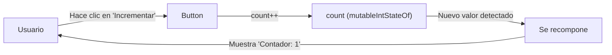
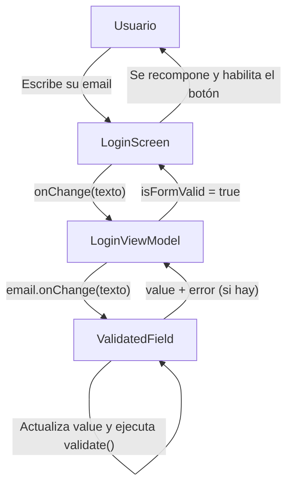
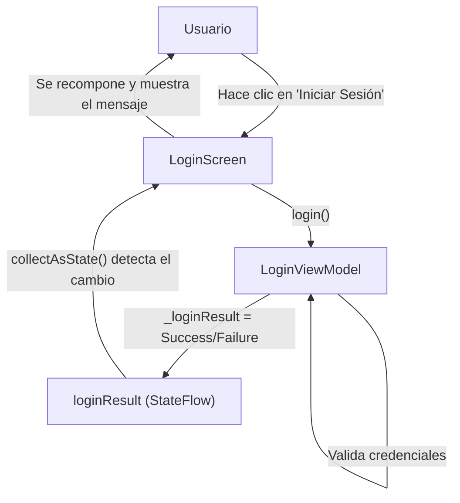

# Formularios en Jetpack Compose

> **Asignatura:** Construcción de aplicaciones móviles  
> **Universidad:** Universidad del Quindío  
> **Programa:** Ingeniería de Sistemas y Computación  
> **Docente:** Carlos Andrés Florez 

## Introducción
En esta guía, exploraremos cómo manejar el estado en Jetpack Compose utilizando composables. Veremos cómo crear formularios interactivos que respondan a las entradas del usuario y cómo gestionar el estado de manera eficiente para garantizar una experiencia de usuario fluida.

En la clase anterior, aprendimos sobre los composables y cómo construir interfaces de usuario declarativas. Ahora, profundizaremos en la gestión del estado dentro de estos composables.

## Recomposición
Una de las características más poderosas de Jetpack Compose es la recomposición. La recomposición ocurre cuando el estado de un composable cambia, lo que provoca que la UI se actualice automáticamente para reflejar esos cambios. Por ejemplo, si tenemos un composable que muestra un contador y el valor del contador cambia, Jetpack Compose volverá a ejecutar ese composable para actualizar la UI con el nuevo valor.

Ejemplo de un contador simple:

```kotlin
@Composable
fun Contador() {
    var count by remember { mutableIntStateOf(0) }

    Column(
        horizontalAlignment = Alignment.CenterHorizontally,
        verticalArrangement = Arrangement.Center
    ) {
        Text(text = "Contador: $count")
        Button(onClick = { count++ }) {
            Text("Incrementar")
        }
    }
}
```

Cuando el usuario hace clic en el botón “Incrementar”, el valor de `count` cambia, lo que provoca que el composable `Contador` se recomponga y actualice la UI para mostrar el nuevo valor del contador. Para evitar que el estado se pierda durante las recomposiciones, utilizamos `remember` junto con `mutableStateOf`. Esto asegura que el valor de `count` se mantenga entre recomposiciones.

### ¿Cómo funciona la recomposición?
El siguiente diagrama muestra el ciclo que ocurre cada vez que el usuario interactúa con el composable `Contador`:



> [!IMPORTANT]
> `mutableIntStateOf` es una función que crea un estado observable para un valor entero. Cuando el valor cambia, Jetpack Compose detecta el cambio y vuelve a ejecutar cualquier composable que dependa de ese estado, lo que resulta en una actualización automática de la UI.
> 
> Por otro lado, `remember` es una función que permite a Jetpack Compose recordar el valor de una variable entre recomposiciones. Esto es crucial para mantener el estado de la UI, ya que sin `remember`, el valor de `count` se reiniciaría a 0 cada vez que el composable se recomponga.

Para evidenciar la recomposición, podemos agregar un mensaje de log al inicio del composable:

```kotlin
@Composable
fun Contador() {
    Log.d("Recomposición", "El composable Contador se ha recompuesto")
    var count by remember { mutableIntStateOf(0) }
    // Resto del código...
}
```

Ejecute la aplicación y observe el logcat. Cada vez que haga clic en el botón “Incrementar”, verá el mensaje de log indicando que el composable se ha recompuesto.

También es importante mencionar que Jetpack Compose optimiza las recomposiciones al solo volver a ejecutar los composables afectados por el cambio de estado, en lugar de toda la jerarquía de UI. Esto mejora significativamente el rendimiento y la eficiencia de la aplicación. Por ejemplo, si `Contador` es parte de una pantalla más grande, solo `Contador` se recompone cuando `count` cambia, mientras que el resto de la pantalla permanece intacta.

## Manejo del Estado en Formularios
En formularios, es común tener múltiples campos de entrada que necesitan mantener su estado. Podemos utilizar `remember` y `mutableStateOf` para cada campo de entrada para asegurarnos de que sus valores se mantengan durante las recomposiciones.

Abra el proyecto de la guía anterior y modifique el composable `LoginScreen` para manejar el estado de los campos de entrada:

```kotlin
@Composable
fun LoginScreen() {

    // Estado para los campos de entrada, remember mantiene el estado entre recomposiciones
    var email by remember { mutableStateOf("") }
    var password by remember { mutableStateOf("") }

    Column(
        modifier = Modifier.fillMaxSize(),
        horizontalAlignment = Alignment.CenterHorizontally,
        verticalArrangement = Arrangement.spacedBy(space = 16.dp, alignment = CenterVertically)
    ) {
        OutlinedTextField(
            value = email, // Estado del campo de email
            onValueChange = { email = it }, // Actualiza el estado cuando el usuario escribe. 
            label = {
                Text(text = "Email")
            }
        )
        OutlinedTextField(
            value = password, // Estado del campo de password
            onValueChange = { password = it }, // Actualiza el estado cuando el usuario escribe
            visualTransformation = PasswordVisualTransformation(),
            label = {
                Text(text = "Password")
            }
        )
        Button(
            onClick = {
                // Se imprime el email y password en el logcat
                Log.d("Login", "Email: $email, Password: $password")
            },
            content = {
                Text(text = "Iniciar Sesión")
            }
        )
            
    }
}
```

En este ejemplo, hemos creado dos variables de estado, `username` (email) y `password`, para almacenar los valores de los campos de entrada. Cada vez que el usuario escribe en uno de los campos, el estado correspondiente se actualiza, lo que provoca una recomposición del composable y actualiza la UI con los nuevos valores.

Ejecute la aplicación y pruebe el formulario de inicio de sesión. Observe cómo los valores de los campos de entrada se mantienen incluso cuando la UI se recompone.

> **Importante:** Se han cambiado los `TextField` por `OutlinedTextField`, que es una variante que agrega un borde alrededor del campo de entrada y un label que se mueve hacia arriba cuando el usuario comienza a escribir. Esto mejora la experiencia del usuario al hacer que los campos de entrada sean más visibles y fáciles de usar.

## Manejo de errores de validación
En formularios, es común necesitar validar la entrada del usuario y mostrar mensajes de error si la entrada no es válida. Podemos manejar esto utilizando estados adicionales para los mensajes de error.

Modifique el composable `LoginScreen` para incluir validación y manejo de errores:

```kotlin
@Composable
fun LoginScreen() {

    // Estado para los campos de texto
    var email by remember { mutableStateOf("") }
    var password by remember { mutableStateOf("") }

    // Permite controlar cuándo mostrar los errores
    var showEmailError by remember { mutableStateOf(false) }
    var showPasswordError by remember { mutableStateOf(false) }

    // Mensajes de error
    val emailError = if (showEmailError) validateEmail(email) else null
    val passwordError = if (showPasswordError) validatePassword(password) else null
    val isFormValid = validateEmail(email) == null && validatePassword(password) == null

    Column(
        modifier = Modifier.fillMaxSize(),
        horizontalAlignment = Alignment.CenterHorizontally,
        verticalArrangement = Arrangement.spacedBy(space = 16.dp, alignment = CenterVertically)
    ) {
        OutlinedTextField(
            value = email,
            onValueChange = {
                email = it
                showEmailError = true // Mostrar error al cambiar el valor
            },
            label = {
                Text(text = "Email")
            },
            isError = emailError != null, // Se muestra el borde rojo si hay error
            supportingText = {
                emailError?.let {
                    Text(
                        text = it // Mensaje de error debajo del campo
                    )
                }
            },
            keyboardOptions = KeyboardOptions(keyboardType = KeyboardType.Email) // Opcional pero recomendado para email
        )
        OutlinedTextField(
            value = password,
            onValueChange = {
                password = it
                showPasswordError = true // Mostrar error al cambiar el valor
            },
            visualTransformation = PasswordVisualTransformation(),
            label = {
                Text(text = "Password")
            },
            isError = passwordError != null, // Se muestra el borde rojo si hay error
            supportingText = {
                passwordError?.let {
                    Text(
                        text = it // Mensaje de error debajo del campo
                    )
                }
            },
            keyboardOptions = KeyboardOptions(keyboardType = KeyboardType.Password) // Opcional pero recomendado para password
        )
        Button(
            onClick = {
                // Se imprime el email y password en el logcat
                Log.d("Login", "Email: $email, Password: $password")
            },
            enabled = isFormValid,
            content = {
                Text(text = "Iniciar Sesión")
            }
        )

    }
}
```

Adicionalmente, agregue las funciones de validación en `LoginScreen.kt`:

```kotlin
fun validateEmail(email: String): String? {
    return when {
        email.isEmpty() -> "El email es obligatorio"
        !Patterns.EMAIL_ADDRESS.matcher(email).matches() -> "Ingresa un email válido"
        else -> null
    }
}

fun validatePassword(password: String): String? {
    return when {
        password.isEmpty() -> "La contraseña es obligatoria"
        password.length < 6 -> "La contraseña debe tener al menos 6 caracteres"
        else -> null
    }
}
```

El formulario ahora valida la entrada del usuario y muestra mensajes de error debajo de los campos si la entrada no es válida. El botón de inicio de sesión solo estará habilitado cuando ambos campos sean válidos.

Ejecute la aplicación y pruebe el formulario con diferentes entradas para ver cómo se manejan los errores de validación.

La complejidad de los formularios puede aumentar rápidamente, especialmente cuando se manejan múltiples campos y validaciones. Por lo tanto, es importante separar la lógica de estado y validación del UI para mantener el código limpio y manejable.

## ViewModel y State Hoisting
Para aplicaciones más complejas, es recomendable utilizar un ViewModel para gestionar el estado de la UI. El patrón de “State Hoisting” implica mover el estado fuera de los composables y gestionarlo en un `ViewModel`, lo que facilita la separación de responsabilidades y mejora la testabilidad.

Un `ViewModel` puede contener el estado del formulario, las funciones de validación y cualquier otra lógica relacionada con la UI. Los composables simplemente reciben el estado y las funciones necesarias como parámetros, la idea es que los composables sean lo más “tontos” posible, es decir, que solo se encuarguen de mostrar la UI y no de gestionar el estado o la lógica de negocio.

Para implementar esto, siga los siguientes pasos:

### 1. Agregar la dependencia de ViewModel
Para iniciar, agregue la dependencia de ViewModel en su archivo `build.gradle.kts` del módulo de la aplicación:

```kotlin
implementation(libs.androidx.lifecycle.viewmodel.compose)
```

Agregue la siguiente línea en la sección `[libraries]` en el archivo `libs.versions.toml`:

```toml
androidx-lifecycle-viewmodel-compose = { module = "androidx.lifecycle:lifecycle-viewmodel-compose", version.ref = "lifecycleViewmodelCompose" }
```

Y en la sección `[versions]` del mismo archivo `libs.versions.toml`, agregue la versión correspondiente:

```toml
lifecycleViewmodelCompose = "2.10.0"
```

Una vez agregada la dependencia, sincronice el proyecto para descargarla.

### 2. Crear el ViewModel
Dentro del paquete `features/login`, cree un nuevo archivo llamado `LoginViewModel.kt`, la idea es que el ViewModel esté en el mismo paquete que el composable que va a gestionar. Agregue el siguiente código al archivo:

```kotlin
package com.example.demoapp.features.login

import androidx.compose.runtime.getValue
import androidx.compose.runtime.mutableStateOf
import androidx.compose.runtime.setValue
import androidx.lifecycle.ViewModel
import android.util.Patterns

class LoginViewModel : ViewModel() {
    // Estado para los campos de texto
    var email by mutableStateOf("")
        private set // Solo se puede modificar desde el ViewModel

    var password by mutableStateOf("")
        private set // Solo se puede modificar desde el ViewModel

    // Permite controlar cuándo mostrar los errores
    var showEmailError by mutableStateOf(false)
        private set // Solo se puede modificar desde el ViewModel

    var showPasswordError by mutableStateOf(false)
        private set // Solo se puede modificar desde el ViewModel

    // Mensajes de error. get() para que sean de solo lectura desde el exterior
    val emailError: String?
        get() = if (showEmailError) validateEmail(email) else null

    val passwordError: String?
        get() = if (showPasswordError) validatePassword(password) else null

    val isFormValid: Boolean
        get() = validateEmail(email) == null && validatePassword(password) == null

    fun onEmailChange(newEmail: String) {
        email = newEmail
        showEmailError = true
    }

    fun onPasswordChange(newPassword: String) {
        password = newPassword
        showPasswordError = true
    }

    private fun validateEmail(email: String): String? {
        return when {
            email.isEmpty() -> "El email es obligatorio"
            !Patterns.EMAIL_ADDRESS.matcher(email).matches() -> "Ingresa un email válido"
            else -> null
        }
    }

    private fun validatePassword(password: String): String? {
        return when {
            password.isEmpty() -> "La contraseña es obligatoria"
            password.length < 6 -> "La contraseña debe tener al menos 6 caracteres"
            else -> null
        }
    }
}
```

Observe cómo el `ViewModel` contiene todo el estado y la lógica de validación del formulario. Las funciones `onEmailChange` y `onPasswordChange` se utilizan para actualizar el estado cuando el usuario escribe en los campos de entrada. Literalmente lo que hicimos fue mover los estados y funciones del composable al `ViewModel`.

Pero hay muchas variables y funciones repetitivas que podemos mejorar para que el código sea más limpio y reutilizable. Para esto, modifique nuevamente el `LoginViewModel` para que quede así:

```kotlin
package com.example.demoapp.features.login

import android.util.Patterns
import androidx.lifecycle.ViewModel
import com.example.demoapp.core.utils.ValidatedField

class LoginViewModel : ViewModel() {

    val email = ValidatedField("") { value ->
        when {
            value.isEmpty() -> "El email es obligatorio"
            !Patterns.EMAIL_ADDRESS.matcher(value).matches() -> "Ingresa un email válido"
            else -> null
        }
    }

    val password = ValidatedField("") { value ->
        when {
            value.isEmpty() -> "La contraseña es obligatoria"
            value.length < 6 -> "La contraseña debe tener al menos 6 caracteres"
            else -> null
        }
    }

    val isFormValid: Boolean
        get() = email.isValid
                && password.isValid

    // Es útil para resetear el formulario después de un login exitoso
    fun resetForm() {
        email.reset()
        password.reset()
    }

}
```

Adicionalmente, dentro del paquete `core/utils`, cree un nuevo archivo llamado `ValidatedField.kt` y agregue el siguiente código:

```kotlin
package com.example.demoapp.core.utils

import androidx.compose.runtime.getValue
import androidx.compose.runtime.mutableStateOf
import androidx.compose.runtime.setValue

class ValidatedField<T>(
    private val initialValue: T,
    private val validate: (T) -> String?
) {
    // Estado del valor del campo
    var value by mutableStateOf(initialValue)
        private set

    // Estado para controlar cuándo mostrar el error
    var showError by mutableStateOf(false)
        private set

    // Mensaje de error. get() para que sea de solo lectura desde el exterior
    val error: String?
        get() = if (showError) validate(value) else null

    // Indica si el campo es válido, es de solo lectura desde el exterior
    val isValid: Boolean
        get() = validate(value) == null

    // Función para actualizar el valor del campo
    fun onChange(newValue: T) {
        value = newValue
        showError = true
    }

    // Función para resetear el campo a su valor inicial
    fun reset() {
        value = initialValue
        showError = false
    }
}
```

Ahora, el `ValidatedField` encapsula la lógica de validación y el estado relacionado al campo, lo que hace que el `LoginViewModel` sea más limpio y menos repetitivo. Esta clase es reutilizable y puede ser utilizada para otros formularios en la aplicación ya que es genérica y recibe la función de validación como parámetro.

### 3. Modificar el Composable para usar ViewModel
Luego, modifique el composable `LoginScreen` para recibir el `ViewModel` como parámetro, dejando en el composable solo la lógica de UI:

```kotlin
@Composable
fun LoginScreen(
    viewModel: LoginViewModel = viewModel() // Se crea o se obtiene el ViewModel
) {
    Column(
        modifier = Modifier.fillMaxSize().padding(30.dp),
        horizontalAlignment = Alignment.CenterHorizontally,
        verticalArrangement = Arrangement.spacedBy(space = 16.dp, alignment = CenterVertically)
    ) {
        OutlinedTextField(
            modifier = Modifier.fillMaxWidth(),
            value = viewModel.email.value, // Estado del campo de email desde el ViewModel
            onValueChange = { viewModel.email.onChange(it) }, // Actualiza el estado en el ViewModel
            label = {
                Text(text = "Email")
            },
            isError = viewModel.email.error != null, // Se muestra el borde rojo si hay error
            supportingText = viewModel.email.error?.let { error ->
                { Text(text = error) }
            },
            keyboardOptions = KeyboardOptions(keyboardType = KeyboardType.Email)
        )
        OutlinedTextField(
            modifier = Modifier.fillMaxWidth(),
            value = viewModel.password.value, // Estado del campo de password desde el ViewModel
            onValueChange = { viewModel.password.onChange(it) }, // Actualiza el estado en el ViewModel
            visualTransformation = PasswordVisualTransformation(),
            label = {
                Text(text = "Password")
            },
            isError = viewModel.password.error != null, // Se muestra el borde rojo si hay error
            supportingText = viewModel.password.error?.let { error ->
                { Text(text = error) }
            },
            keyboardOptions = KeyboardOptions(keyboardType = KeyboardType.Password)
        )
        Button(
            onClick = {
                // Se imprime el email y password en el logcat por ahora
                Log.d("Login", "Email: ${viewModel.email.value}, Password: ${viewModel.password.value}")
            },
            enabled = viewModel.isFormValid,
            content = {
                Text(text = "Iniciar Sesión")
            }
        )

    }
}
```

La función `viewModel()` es proporcionada por la biblioteca de `lifecycle-viewmodel-compose` y se encarga de crear o recuperar una instancia del `ViewModel` asociado al ciclo de vida del composable, lo que garantiza que el estado se mantenga incluso durante cambios de configuración como rotaciones de pantalla.

### Flujo de información
El siguiente diagrama muestra cómo fluye la información desde que el usuario escribe en los campos de entrada hasta que se actualiza la UI con los mensajes de error y el estado del formulario:



### 4. Ejecutar la aplicación
Ejecute la aplicación y pruebe el formulario de inicio de sesión. Observe cómo el estado se mantiene y se gestiona a través del `ViewModel`, lo que facilita la separación de la lógica de negocio y la UI.

Al dar click en el botón de login, los valores ingresados se imprimirán en el logcat.

### 5. Manejar mensajes de éxito o error
Para mejorar la experiencia del usuario, podemos mostrar mensajes de éxito o error en la UI después de que el usuario intente iniciar sesión. Podemos agregar un estado adicional en el `LoginViewModel` para manejar estos mensajes.

```kotlin
private val _loginResult = MutableStateFlow<RequestResult?>(null)
val loginResult: StateFlow<RequestResult?> = _loginResult.asStateFlow()
```

`StateFlow` es una forma eficiente de manejar estados que pueden cambiar con el tiempo y permite a los composables observar estos cambios de manera reactiva, es decir, cuando el valor del `StateFlow` cambia, los composables que lo están observando se recomponen automáticamente para reflejar el nuevo estado. Por otro lado, `MutableStateFlow` es una implementación mutable de `StateFlow` que permite actualizar su valor, es decir, es la versión que utilizamos para cambiar el estado internamente dentro del `ViewModel`.

Ahora, agregue la función `login` en el `LoginViewModel` para simular un proceso de inicio de sesión:

```kotlin
fun login() {
    if (isFormValid) {
        // Simulación de un proceso de login con datos estáticos
        _loginResult.value = if (email.value == "carlos@email.com" && password.value == "123456") {
            RequestResult.Success("Login exitoso")
        } else {
            RequestResult.Failure("Credenciales inválidas")
        }
    }
}
```

Esto implica también crear una clase sellada `RequestResult` para representar los diferentes estados de la solicitud. Cree dicha clase en el paquete `core/utils`:

```kotlin
package com.example.demoapp.core.utils

sealed class RequestResult {
    data class Success(val message: String) : RequestResult()
    data class Failure(val errorMessage: String) : RequestResult()
}
```

### 6. Mostrar mensajes de éxito o error en la UI
Una vez hecho esto, modifique el botón de login en `LoginScreen` para llamar a la función `login` del `ViewModel` y observar el estado de `loginResult` para mostrar los mensajes correspondientes en la UI.

Primero, observe el estado de `loginResult` en el composable:

```kotlin
// Observar el estado de loginResult, cambia automáticamente cuando hay un nuevo valor
val loginResult by viewModel.loginResult.collectAsState()
```

Luego, modifique el botón de login para llamar a la función `login` del `ViewModel`:

```kotlin
Button(
    onClick = {
        viewModel.login()
    },
    enabled = viewModel.isFormValid,
    content = {
        Text(text = "Login")
    }
)
```

Finalmente, agregue el siguiente código debajo del botón para mostrar los mensajes de éxito o error:

```kotlin
// Mostrar mensajes de éxito o error
loginResult?.let { result ->
    when (result) {
        is RequestResult.Success -> {
            Text(text = result.message, color = Color.Green)
        }
        is RequestResult.Failure -> {
            Text(text = result.errorMessage, color = Color.Red)
        }
    }
}
```

Este bloque de código verifica si `loginResult` no es nulo y muestra el mensaje correspondiente en la UI, utilizando colores diferentes para el éxito (verde) y el error (rojo). Claramente, esto es mucho más amigable para el usuario.

### Flujo de información
El siguiente diagrama muestra cómo fluye la información desde el clic del usuario hasta que aparece el mensaje en pantalla:



### 7. Ejecutar la aplicación
Ejecute la aplicación y pruebe el formulario de inicio de sesión. Ingrese las credenciales correctas e observe el mensaje de éxito. Luego, ingrese credenciales incorrectas para ver el mensaje de error.

## Scaffold y Snackbar
Jetpack Compose proporciona un componente llamado `Scaffold` que facilita la creación de una estructura básica para la pantalla de la aplicación, incluyendo barras de herramientas, menús y barras de navegación. Además, `Scaffold` permite mostrar `Snackbar`, que son mensajes breves que aparecen en la parte inferior de la pantalla para informar al usuario sobre eventos o acciones.

Para mejorar la experiencia del usuario, podemos utilizar `Snackbar` para mostrar los mensajes de éxito o error en lugar de mostrarlos directamente en la UI.

### 1. Modificar LoginScreen para usar Scaffold y Snackbar
Modifique el composable `LoginScreen` para envolver su contenido dentro de un `Scaffold` y utilizar un `SnackbarHost` para mostrar los mensajes:

```kotlin
package com.example.demoapp.features.login

// Importaciones necesarias ...

@Composable
fun LoginScreen(
    onNavigateToUsers: () -> Unit,
    viewModel: LoginViewModel = viewModel()
) {

    // Estado para gestionar los snackbars
    val snackbarHostState = remember { SnackbarHostState() }
    // Observar el estado de loginResult
    val loginResult by viewModel.loginResult.collectAsState()

    // Efecto para mostrar el snackbar cuando hay resultado
    LaunchedEffect(loginResult) {
        loginResult?.let { result ->
            // Obtener el mensaje según el resultado
            val message = when (result) {
                is RequestResult.Success -> result.message
                is RequestResult.Failure -> result.errorMessage
            }
            snackbarHostState.showSnackbar(message) // Mostrar el snackbar con el mensaje

            // Navegar a la pantalla de usuarios si el login fue exitoso. Se puede agregar un delay para que el usuario alcance a ver el mensaje
            if (result is RequestResult.Success) {
                delay(1000) // 1 segundo
                onNavigateToUsers()
            }

            // Reseta el estado del loginResult en el ViewModel después de mostrar el mensaje
            viewModel.resetLoginResult()
        }
    }

    // Se envuelve el contenido dentro de un Scaffold
    Scaffold(
        snackbarHost = {
            // Mostrar el SnackbarHost para gestionar los snackbars. Un SnackbarHost es un contenedor que muestra los snackbars.
            SnackbarHost(snackbarHostState) { data ->
                val isError = loginResult is RequestResult.Failure
                // Mostrar el Snackbar con el estilo adecuado según si es error o éxito
                Snackbar(
                    containerColor = if (isError) MaterialTheme.colorScheme.error else MaterialTheme.colorScheme.primary,
                    contentColor = Color.White
                ) {
                    Text(data.visuals.message)
                }
            }
        }
    ) { paddingValues ->

        Column(
            modifier = Modifier
                .fillMaxSize()
                .padding(paddingValues) // Aplicar los padding del Scaffold
                .padding(horizontal = 30.dp), // Padding horizontal adicional
            horizontalAlignment = Alignment.CenterHorizontally,
            verticalArrangement = Arrangement.spacedBy(space = 16.dp, alignment = CenterVertically)
        ) {
            OutlinedTextField(
                modifier = Modifier.fillMaxWidth(),
                value = viewModel.email.value,
                onValueChange = { viewModel.email.onChange(it) },
                label = {
                    Text(text = "Email")
                },
                isError = viewModel.email.error != null,
                supportingText = viewModel.email.error?.let { error ->
                    { Text(text = error) }
                },
                keyboardOptions = KeyboardOptions(keyboardType = KeyboardType.Email)
            )
            OutlinedTextField(
                modifier = Modifier.fillMaxWidth(),
                value = viewModel.password.value,
                onValueChange = { viewModel.password.onChange(it) },
                visualTransformation = PasswordVisualTransformation(),
                label = {
                    Text(text = "Password")
                },
                isError = viewModel.password.error != null,
                supportingText = viewModel.password.error?.let { error ->
                    { Text(text = error) }
                },
                keyboardOptions = KeyboardOptions(keyboardType = KeyboardType.Password)
            )
            Button(
                onClick = {
                    viewModel.login()
                },
                enabled = viewModel.isFormValid,
                content = {
                    Text(text = "Iniciar Sesión")
                }
            )

        }

    }

}
```

Donde invoque a `LoginScreen`, ahora debe pasar la función `onNavigateToUsers` que por ahora puede ser una función vacía ya que la navegación la veremos más adelante.

### 2. Modificar LoginViewModel para resetear loginResult
Agregue la función `resetLoginResult` en el `LoginViewModel` para resetear el estado de `loginResult` después de mostrar el mensaje:

```kotlin
fun resetLoginResult() {
    _loginResult.value = null
}
```

### 3. Ejecutar la aplicación
Ejecute la aplicación y pruebe el formulario de inicio de sesión. Ingrese las credenciales correctas e incorrectas para ver cómo los mensajes de éxito o error se muestran utilizando `Snackbar`.

## Actividad práctica
1. **Nuevo formulario de registro:** Cree un nuevo composable llamado `RegisterScreen` que permita a los usuarios registrarse con los siguientes campos: Nombre, Ciudad, Dirección, Email, Contraseña y Confirmar Contraseña. Asegúrese de manejar el estado de cada campo y agregar validaciones similares a las del formulario de inicio de sesión.
2. **Registro ViewModel:** Cree un `RegisterViewModel` para gestionar el estado y la lógica de validación del formulario de registro. Use la clase `ValidatedField` para cada campo del formulario.
3. **Simulación de registro:** Dentro del `RegisterViewModel`, agregue una función `register` que simule el proceso de registro y utilice `RequestResult` para manejar los mensajes de éxito o error.
4. **Formulario de olvido de contraseña:** Cree un nuevo composable llamado `PasswordRecoveryScreen` que permita a los usuarios recuperar su contraseña ingresando su email. Asegúrese de manejar el estado del campo de email y agregar validaciones para verificar que el email sea válido.
5. **Recuperación ViewModel:** Cree un `PasswordRecoveryViewModel` para gestionar el estado y la lógica de validación del formulario de recuperación de contraseña. Use `RequestResult` y `ValidatedField` según sea necesario.
6. **Formulario de recuperación de contraseña:** Cree un nuevo composable llamado `PasswordResetScreen` que permita a los usuarios restablecer su contraseña ingresando un código de verificación de 5 dígitos y una nueva contraseña. Haga que para el código de verificación se utilicen 5 campos de entrada separados, uno para cada dígito. Asegúrese de manejar el estado de cada campo y agregar validaciones para verificar que solo se ingrese un dígito en cada campo y que la nueva contraseña cumpla con los requisitos de seguridad. Use `RequestResult` y `ValidatedField` según sea necesario.
7. **Investigación adicional:** Profundice en `StateFlow`, por qué es una buena opción para manejar estados en aplicaciones Android y cómo se compara con otras opciones como `LiveData` y `mutableStateOf`.